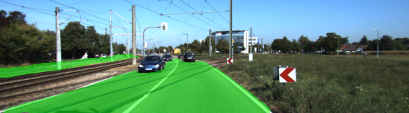
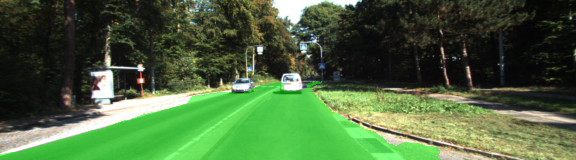
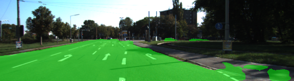
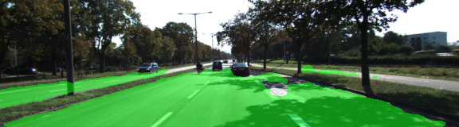
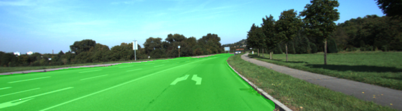
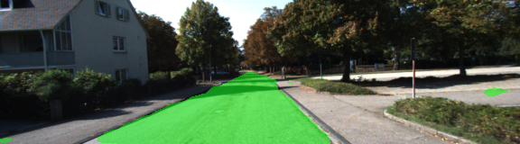
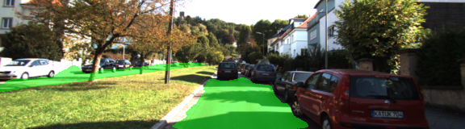

# Semantic Segmentation - Advanced Deep Learning Project
## Self Driving Car Nano-degree
### Introduction
The primary goal of this project is to is to build a Fully Convolutional Network(FCN) that would label the pixels of a road in images processed and identify the drivable area for the self driving car. The basis to train an FCN would be a VGG-16 image classifier architecture.

### Pre-requisites
##### Frameworks and Packages
Verify the following packages are installed.
 - [Python 3](https://www.python.org/)
 - [TensorFlow](https://www.tensorflow.org/)
 - [NumPy](http://www.numpy.org/)
 - [SciPy](https://www.scipy.org/)

#### NVIDIA Driver Setup (Only when NVIDIA GPU processor is used)
Although this project uses the AWS instance for training the model, the following commands need to be executed to ensure the Linux server has NVIDIA driver installed.
```
sudo apt-get remove nvidia-*
wget http://us.download.nvidia.com/XFree86/Linux-x86_64/375.66/NVIDIA-Linux-x86_64-375.66.run
sudo bash ./NVIDIA-Linux-x86_64-375.66.run  --dkms
```

##### Dataset Download
Download the dataset using the command below in the data folder and unzip.
```
wget http://kitti.is.tue.mpg.de/kitti/data_road.zip
```

### Solution Details
##### Solution Architecture
This project uses a pre-trained VGG-16 network as FCN encoder to build a Fully Convolutional Network(FCN). The fully connected layers are first replaced by 1x1 convolutions in the model. The FCN decoder uses 3 convolutional layers that upsample to original image size using kernels and strides resulting in larger convolutions. Skip layers are used to ensure proper results in images of varying block sizes. Significant performance improvements have been observed through the use of skip connections.

##### Training
The model is trained using the Kitti road dataset mentioned above. The sample consists of about 200+ images. The following parameters were chosen for training purposes:
* batch_size=5
* epochs=50
* learning_rate=0.0009

The loss per epoch has averaged around 0.2 and 0.15 for the first 10 epochs and has significantly reduced to around 0.023 at epoch 50. The default batch size set in the original repository has been found to be satisfactory if not optimal for training on GPU powered machine. The training took about 30 minutes on a g3.4xlarge GPU graphics AWS machine. However it took about 24 hours on a CPU powered machine with Intel i7 processor. Securing a spot instance for g3.4xlarge has been a challenge. Had to procure a dedicated instance to finish the project.

The batch size probably could be increased to optimize memory usage, however it did not make much difference once trained on AWS. Also it appears to me that there is not much difference in training after epoch 30-35. Probably it could be tuned down a little bit to avoid additional computation.

##### Results
Some of the sample images have been provided below:
















##### Run
Two different copies of the main file have been created to executed projects on GPU or CPU
```
python main.py
```


**Note** If running this in Jupyter Notebook system messages, such as those regarding test status, may appear in the terminal rather than the notebook.

### Submission
1. Ensure you've passed all the unit tests.
2. Ensure you pass all points on [the rubric](https://review.udacity.com/#!/rubrics/989/view).
3. Submit the following in a zip file.
 - `helper.py`
 - `main.py`
 - `project_tests.py`
 - Newest inference images from `runs` folder  (**all images from the most recent run**)

 ## How to write a README
A well written README file can enhance your project and portfolio.  Develop your abilities to create professional README files by completing [this free course](https://www.udacity.com/course/writing-readmes--ud777).
